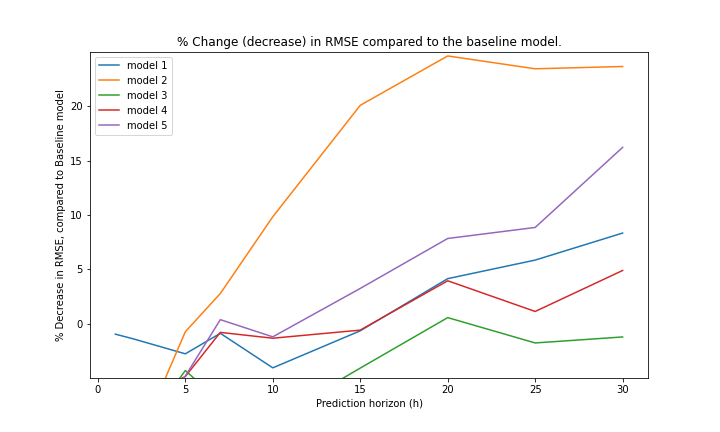
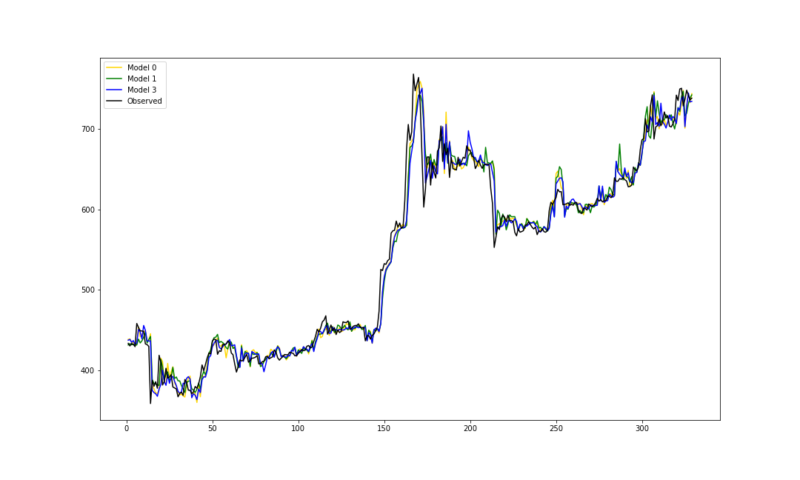
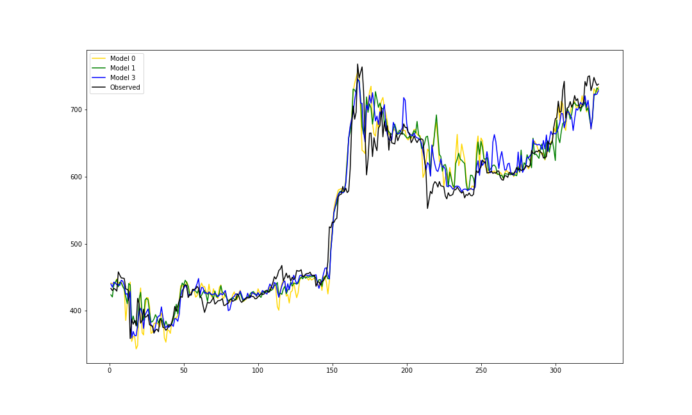
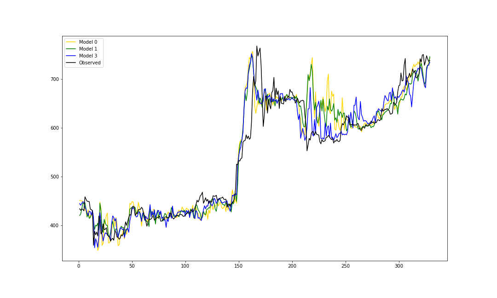
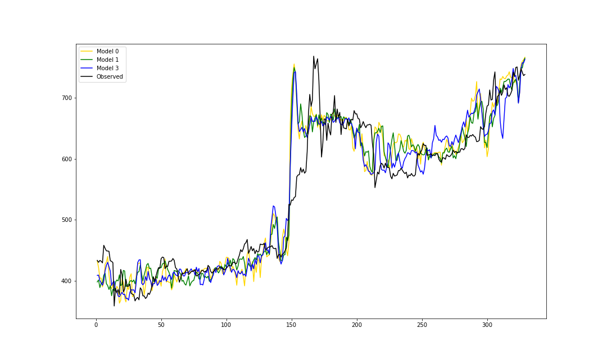

# ChainLet:

## 1. Generate OccMatrix.

1.1 Download Bitcoin input and output data from [here](https://github.com/cakcora/CoinWorks).

1.2 Set the parameter:  **DATA_DIR_PATH** and **OCC_MATRIX_SIZE**.

1.3 Occ Matrix will be generated in the following directory:  **DATA_DIR_PATH + "processed_data/2016/"**.
   
[Source File](./reimplement/python/gen_chainlet.py)

## 2. % Change (decrease) in RMSE compared to the baseline model.

[Source File](./reimplement/python/rmse_comparison.py)

[Result data](./reimplement/result/data/)

## 3. Price prediction for 2016 with 1, 5, 10, 20 day horizons.

    3.1 h = 1 day

    3.1 h = 5 day

    3.1 h = 10 day

    3.1 h = 20 day

[Source File](./reimplement/python/rmse_comparison.py)

[Result data](./reimplement/result/data/)

## Reference:

[ChainLet Paper](http://cakcora.github.io/blockchain/576.pdf)
