# ChainNet

## 1. Time series of daily log returns, transactions, average β0 and β1 numbers in 2017.
   
[Source File](./experiment_data/fig2.ipynb)

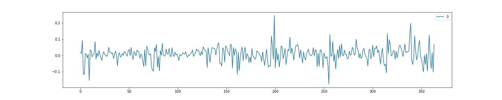
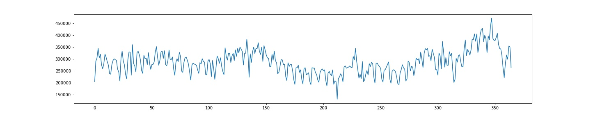
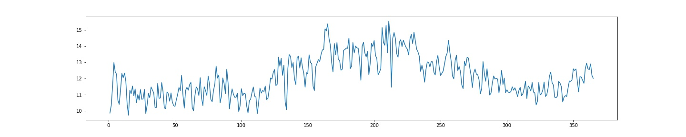
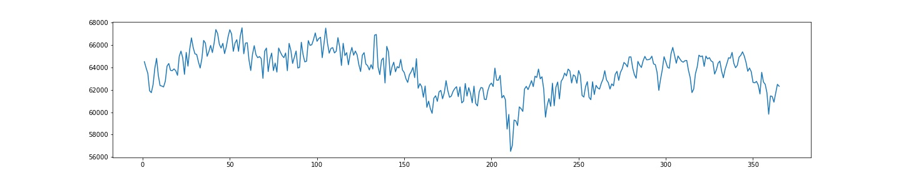

## 2. RMSE of sliding window based predictions of 2017 Bitcoin prices in different window and horizon values.

Models: RF, ENET, GP, XGBT

[Source File](./best_performance/best_performance.py)

<b>window_size = 3</b>

<b>window_size = 5</b>

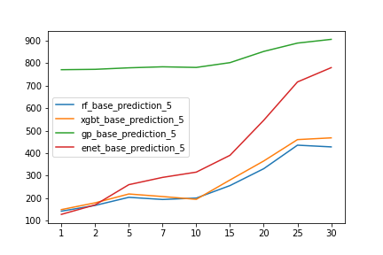

<b>window_size = 7</b>

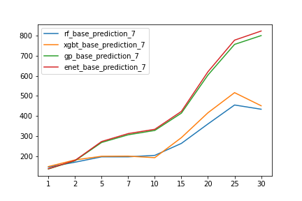

Models: RF, ENET, GP, XGBT, ARIMAX (last version)

[Source File](./experiment_rmse/rmse_models.py)

<b>window_size = 3</b>

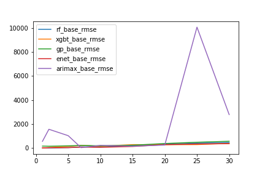

<b>window_size = 5</b>

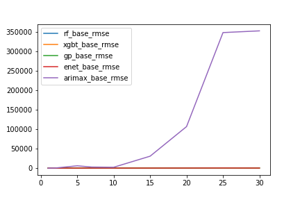

<b>window_size = 7</b>

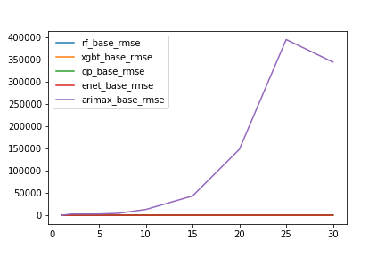

## 3. [Source File](./best_performance/best_performance.py)

    3.1 Random Forest Performance.

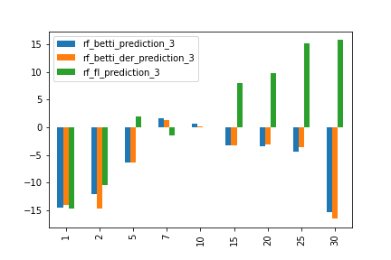
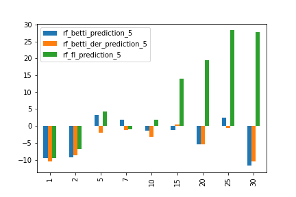
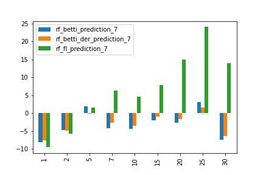

    3.2 Elastic Net model performance.

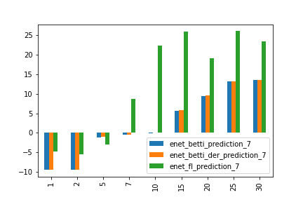
    
    3.3 GP performance:

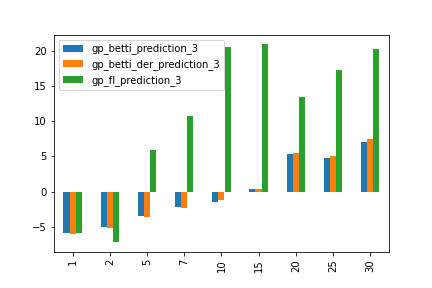
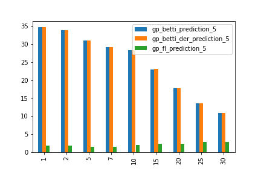
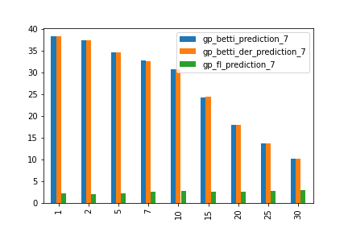

    3.4 XGBT performance:

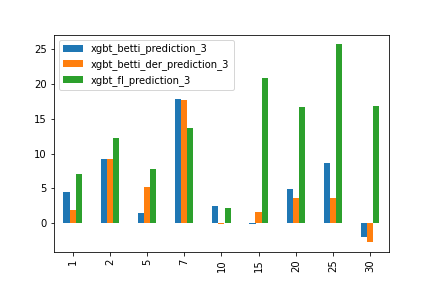

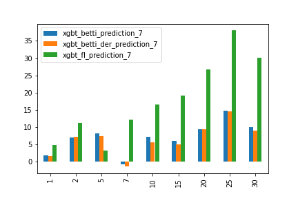

[Result data](./best_performance/result_data/)

## Reference:

[ChainNet Paper](https://arxiv.org/pdf/1908.06971)
