# ChainNet

## 1. Time series of daily log returns, transactions, average β0 and β1 numbers in 2017.
   
[Source File](./experiment_data/fig2.ipynb)

## 2. RMSE of sliding window based predictions of Bitcoin prices in different window and horizon values. 

### 2.1. YEAR = 2017

Models: RF, ENET, GP, XGBT

[Source File](./best_performance/best_performance.py)

<b>window_size = 3: </b>

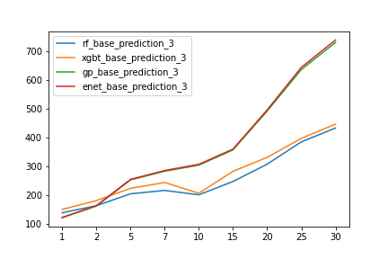

<b>window_size = 5: </b>

<b>window_size = 7: </b>

### 2.1. YEAR = 2020

Models: RF, ENET, GP, XGBT

[Source File](./best_performance/best_performance.py)

<b>window_size = 3: </b>

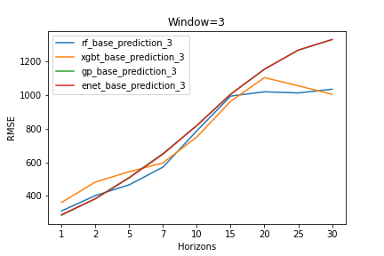

<b>window_size = 5: </b>

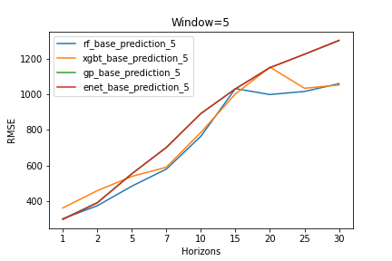

<b>window_size = 7: </b>

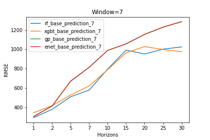
<!-- Models: RF, ENET, GP, XGBT, ARIMAX (last version)

[Source File](./experiment_rmse/rmse_models.py)

<b>window_size = 3</b>

<b>window_size = 5</b>

<b>window_size = 7</b>

 -->

## 3. Best performance 

[Source File](./best_performance/best_performance.py)

### 3.1. YEAR = 2017

    3.1.1. Random Forest Performance.

    3.1.2. Elastic Net model performance.

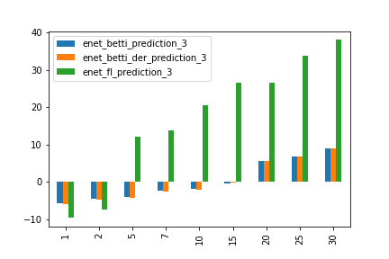
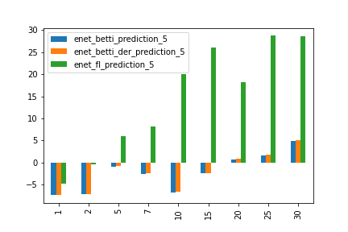

    
    3.1.3. GP performance:

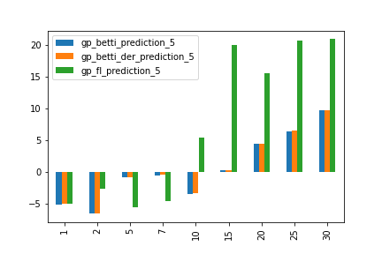
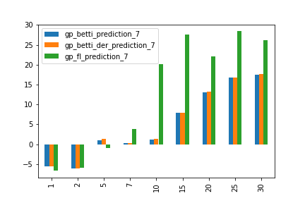

    3.1.4. XGBT performance:

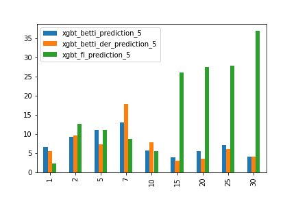

[Result data](./best_performance/result_data/2017/)

### 3.2. YEAR = 2020

    3.2.1. Random Forest Performance.

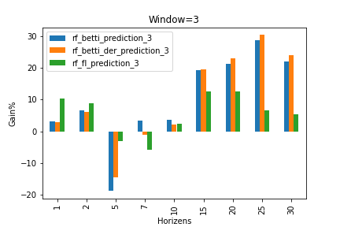
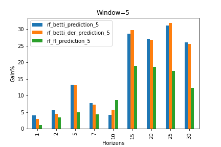
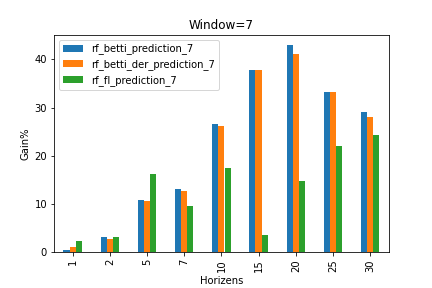

    3.2.2. Elastic Net model performance.

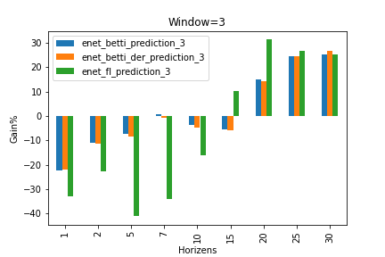
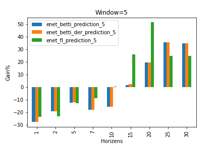
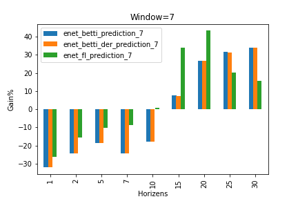
    
    3.2.3. GP performance:

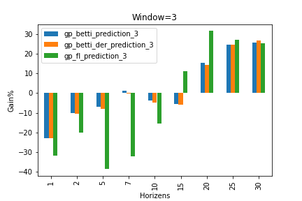
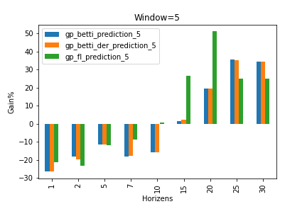
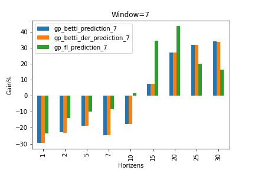

    3.2.4. XGBT performance:

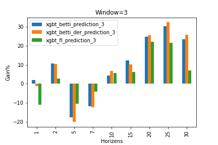

[Result data](./best_performance/result_data/2020/)

## Reference:

[ChainNet Paper](https://arxiv.org/pdf/1908.06971)
