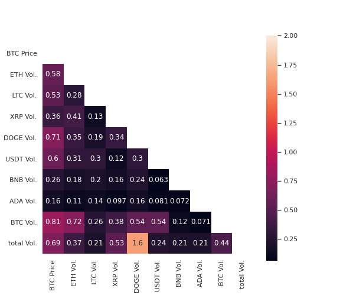

# Currencies-Data/

### 1. Scrape currency data with python.

[Data Preparation](./scrape_currencies_data.py)

### 2. Cryptocurrency market

### 3. Covariance matrix of all cryptocurrency

   

## 4. Best performance 

[Source File](./best_performance/best_performance.py)

### 4.1. YEAR = 2020

    3.1.1. Random Forest Performance.

    4.1.2. Elastic Net model performance.

    
    4.1.3. GP performance:

    4.1.4. XGBT performance:

[Result data](../Figures/)

### 5. Processed data.

[Processed data](./trade/)

