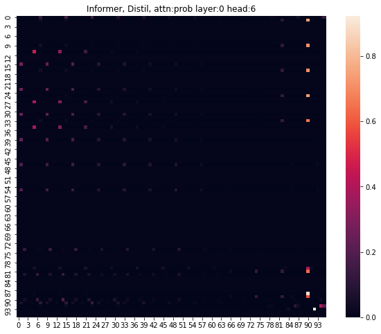
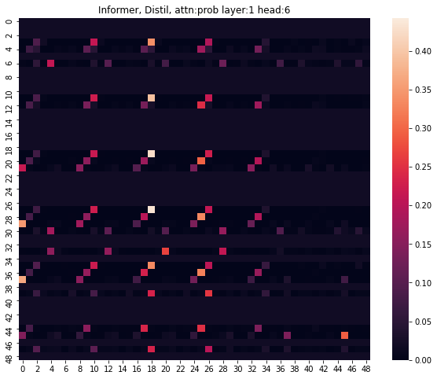

# Informer

### Result: 

[Source file](Informer.ipynb)

[paper: Informer: Beyond Efficient Transformer for Long Sequence Time-Series Forecasting (AAAI'21 Best Paper)](https://arxiv.org/abs/2012.07436)