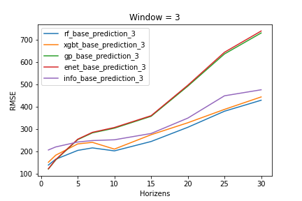
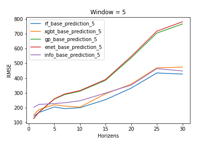
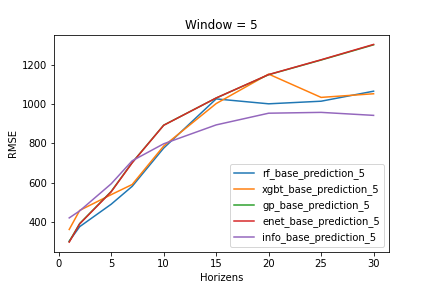

# Informer

## 1. RMSE of sliding window based predictions of Bitcoin prices in different window and horizon values. 

### 2.1. YEAR = 2017

Models: RF, ENET, GP, XGBT

[Source File](../data/processed_data/2017_5models_total_rmse/)

<b>window_size = 3: </b>

<b>window_size = 5: </b>

<b>window_size = 7: </b>

### 2.2. YEAR = 2020

Models: RF, ENET, GP, XGBT

[Source File](../data/processed_data/2017_5models_total_rmse/)

<b>window_size = 3: </b>

<b>window_size = 5: </b>

<b>window_size = 7: </b>

## 3. Best performance 

[Source File](../data/processed_data/2017_5models_total_rmse/)

### 3.1. YEAR = 2020

[paper: Informer: Beyond Efficient Transformer for Long Sequence Time-Series Forecasting (AAAI'21 Best Paper)](https://arxiv.org/abs/2012.07436)
