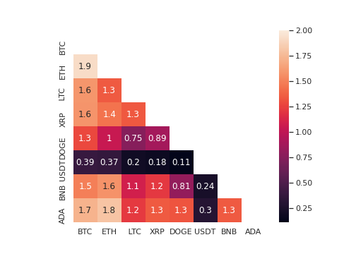
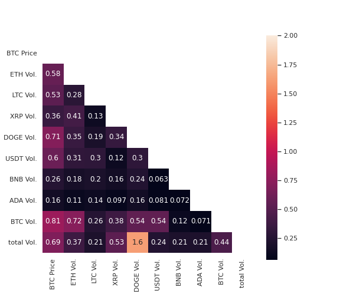

# Currencies-Data/

### 1. Scrape currency data with python.

[Data Preparation](./scrape_currencies_data.py)

### 2. Cryptocurrency market

### 3. Covariance matrix of all cryptocurrency

   

### 4. Processed data.

[Processed data](./trade/)
