# ETH ChainNet

## 1. Bitcoin and ETH Occurrence matrix.

[Data Preparation](./processed_data_07_31___08_29/final_process_step_2.py)

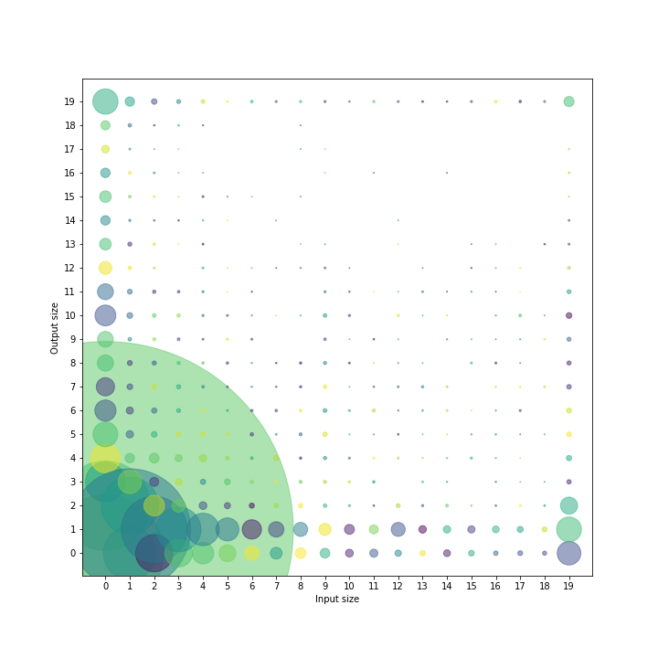

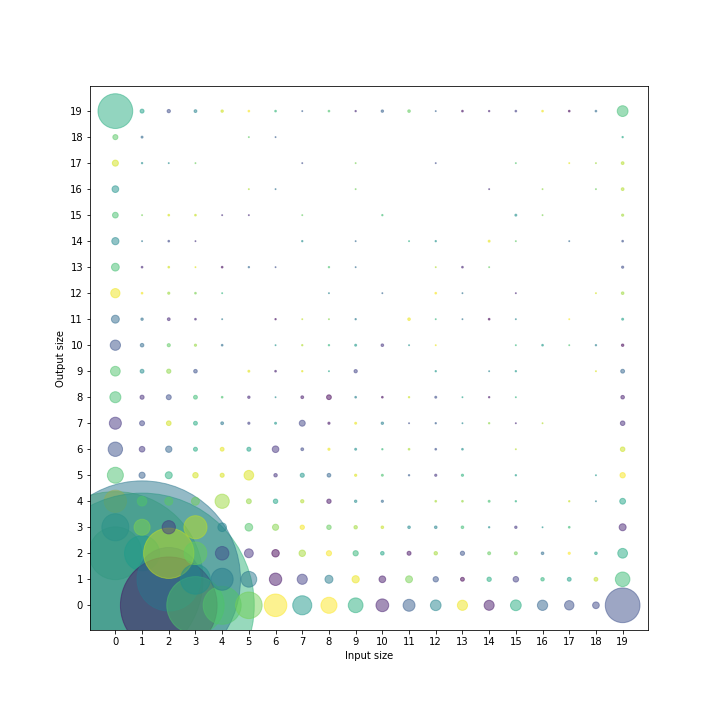
   

## 2. RMSE of sliding window based predictions of Ethereum prices in different window and horizon values. 

### 2.1. YEAR = 2020

Models: RF, ENET, GP, XGBT

[Source File](./best_performance/best_performance.py)

<b>window_size = 3: </b>

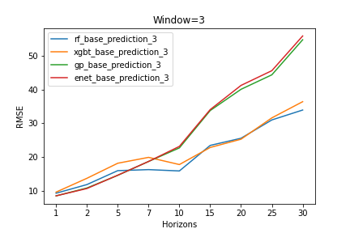

<b>window_size = 5: </b>

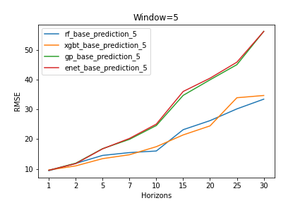

<b>window_size = 7: </b>

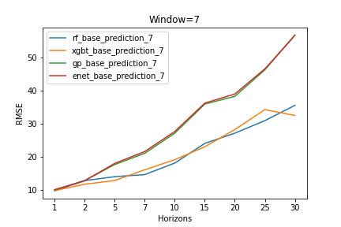

## 3. Best performance 

[Source File](./best_performance/best_performance.py)

### 3.1. YEAR = 2020

    3.1.1. Random Forest Performance.

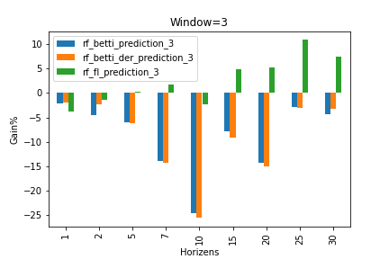
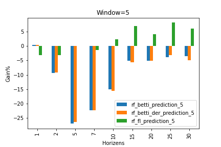
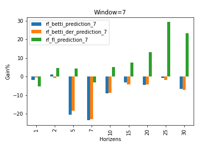

    3.1.2. Elastic Net model performance.

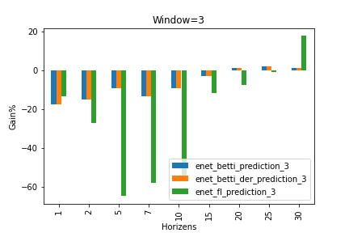
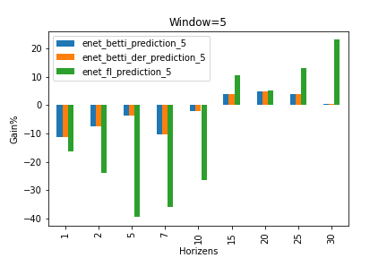
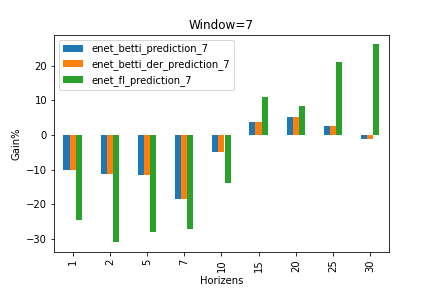
    
    3.1.3. GP performance:

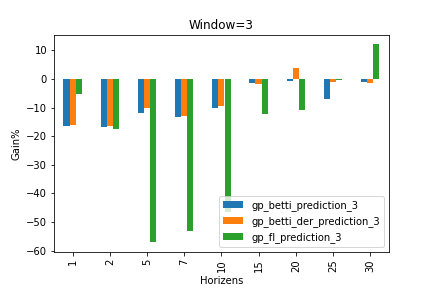
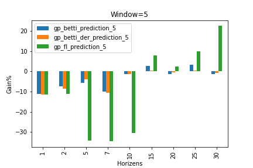
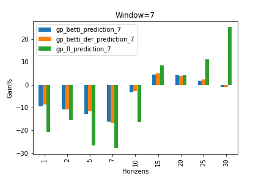

    3.1.4. XGBT performance:

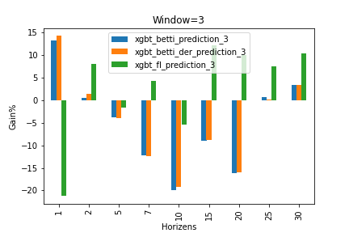
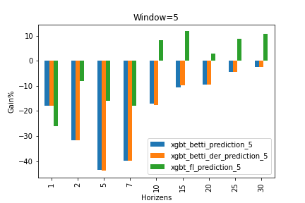
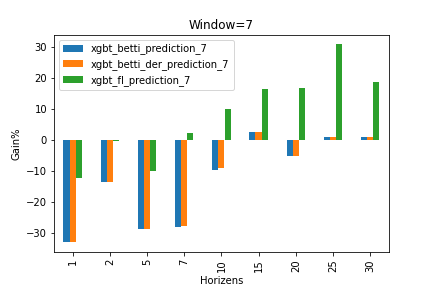

[Result data](./processed_data_07_31___08_29/)

## Reference:

[ChainNet Paper](https://arxiv.org/pdf/1908.06971)
