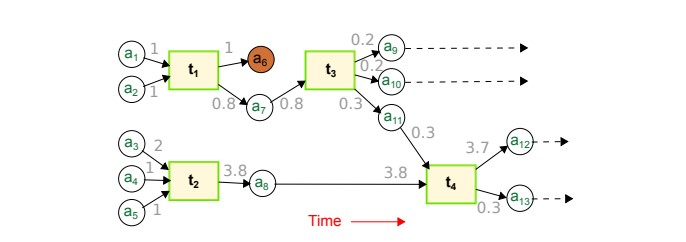
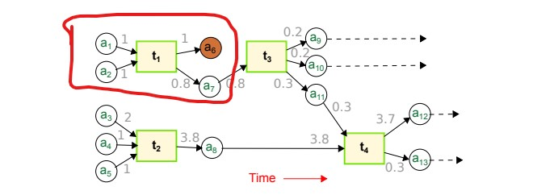

bitcoin_graph:

Chainlet: is denoted as $C_{i->o}$ ,

     |i| input addresses, |o| output addresses

occurrence matrices: $O_{[i_{max} \times  o_{max}]}$

amount matrices: $A_{[i_{max} \times  o_{max}]}$

