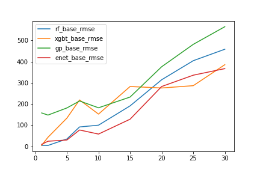
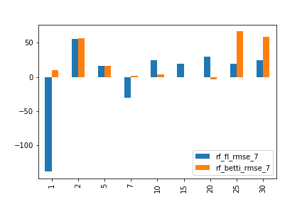
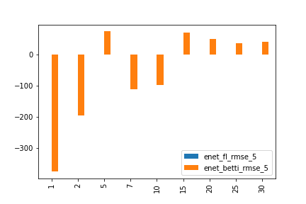
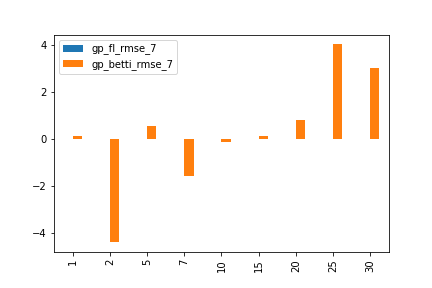
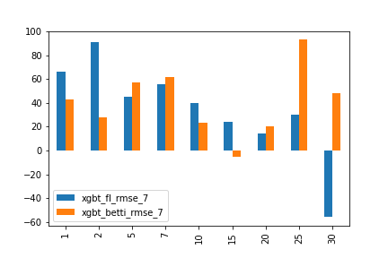

## [TO BE CONTINUED]

## 0. ChainLet:

   (source file)[./chainlet/]

   (data)[./data/]

## 1. Time series of daily log returns, transactions, average β0 and β1 numbers in 2017.
   

[Source File](./paper_result/experiment_data/fig2.ipynb)

## 2. RMSE of sliding window based predictions of 2017 Bitcoin prices in different window and horizon values.

Models: RF, ENET, GP, XGBT

Models: RF, ENET, GP, XGBT, ARIMAX

[Source File](./paper_result/experiment_rmse/rmse_models.py)

## 3. [Source File](./paper_result/models_performance/models_performance.py)

    3.1 Random Forest Performance.

    3.2 Elastic Net model performance.

    
    3.3 GP performance:

    3.4 XGBT performance:

## Reference:

[ChainNet Paper](https://arxiv.org/pdf/1908.06971)